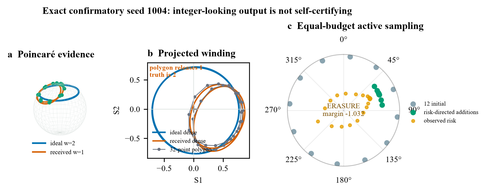
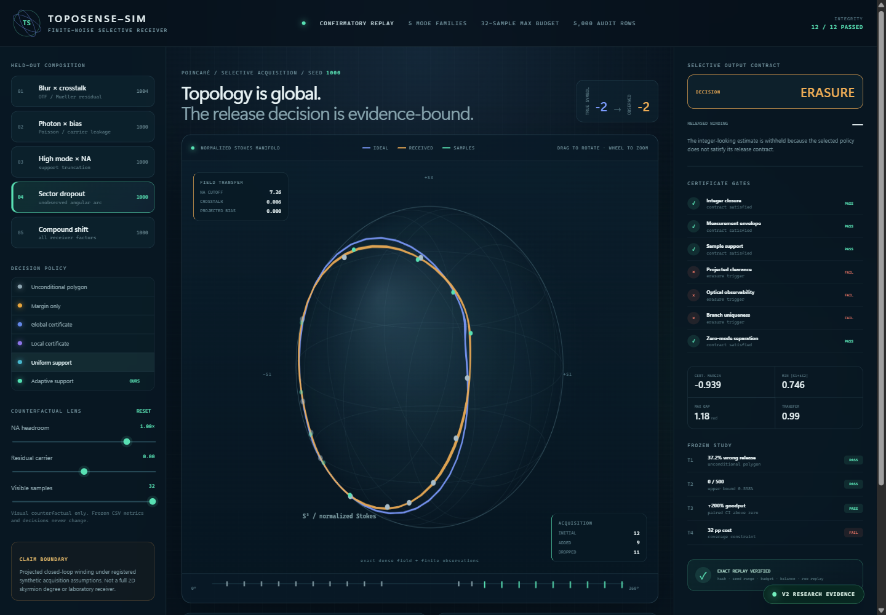
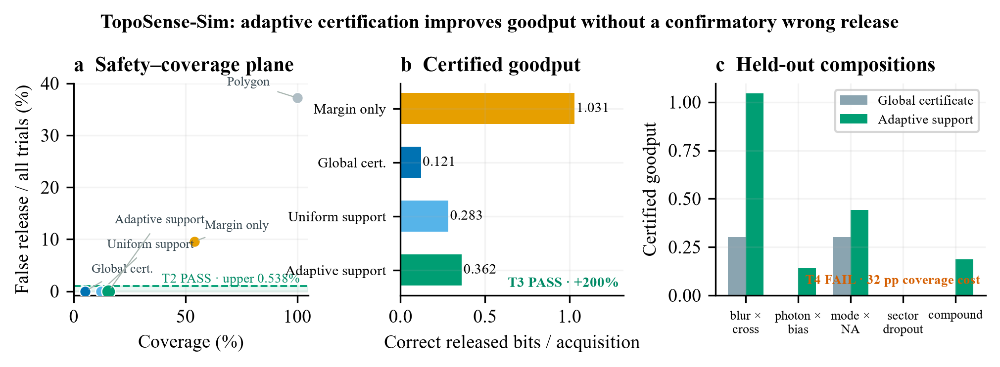

# TopoSense-Sim

A simulated Stokes receiver for studying winding estimates, measurement budgets and erasure decisions.



Sparse polarization measurements can trace the wrong integer winding, especially near a projected zero or with unresolved high-frequency structure. TopoSense measures when a receiver can return a symbol and when it has to request more observations or return an erasure.

## Bound-based winding check

The new `toposense_bounds` package certifies the received complex loop under explicit endpoint-error and global derivative bounds. It accepts measured arrays and bounds only. Its [derivation](docs/BOUND_CERTIFICATE.md) gives the sufficient condition and retains an aliasing counterexample showing why a derivative bound cannot be inferred from adjacent sample slopes.

In an exploratory analytic-loop study, the bounded method released 240 of 600 inputs with zero wrong releases. Unconditional polygon decoding made 173 wrong releases. The 40% coverage is part of the result: all near-origin, high-frequency and missing-sector cases were rejected. These inputs use bounded synthetic noise and known analytic derivative bounds; they are distinct from the H1/H2 sensor experiments.

```bash
python scripts/run_bound_study.py
```

The H1/H2 methods below use empirical support thresholds and local slope estimates. Their historical names include `certificate`, but those methods do not supply the new routine's conditional guarantee.

## Research context

[Topological noise rejection](https://www.nature.com/articles/s41467-025-58232-4) and [anisotropy-based topological encoding](https://www.nature.com/articles/s41377-026-02307-4) study robustness for specific fields and perturbations. The latter includes a 60-degree robustness criterion. TopoSense asks a narrower numerical question about finite observations of `S1 + iS2`: whether the received boundary loop's winding is determined under stated measurement bounds. It does not compute the full two-dimensional skyrmion degree.



## Adaptive acquisition experiment

H2 adds an observed-data-only value-of-information policy that predicts which
next analyzer angle will most reduce the limiting certificate deficit. An
exploratory falsification showed that pure local VOI over-concentrated samples;
a preregistered amendment alternates VOI with global support-recovery steps. The
same 12-initial / 32-maximum measurement budget is used by every paired method.

The optical transfer also has a second implementation: a direct Fourier-series
matrix evaluation that calls neither the production FFT nor its helper. Across
the registered audit grid its maximum complex disagreement was `2.00e-15`, and
every dense received winding agreed.

The 3,000-row frozen H2 confirmation did not support a new safety claim. VOI
produced 81 correct releases versus 75 for the H1 adaptive policy (`+8.0%`
goodput), but the paired interval touched zero and one high-mode/NA false release
violated the registered zero-error gate.

| H2 contract | Outcome |
|---|---:|
| Correct releases | 81 VOI vs 75 H1 adaptive |
| Wrong releases | 1 / 500; T5 fails |
| Paired goodput interval | lower endpoint 0; T6 fails |
| Measurement budget | all rows <= 32 attempts |
| Direct-vs-FFT propagation | max error 2.00e-15 |
| Independent artifact checks | 18 / 18 pass |

See [H2 analysis](experiments/H2-value-of-information/analysis.md),
[summary](artifacts/confirmatory-h2/summary_h2.json), and
[validation report](artifacts/confirmatory-h2/validation-report-h2.json). The
interactive receiver displays these results in the Acquisition study panel.

The artifact synthesizes a two-component Jones boundary field, applies finite-NA transfer and residual polarization background, measures six Poisson–Gaussian analyzer channels with calibration error and angular jitter, and compares unconditional decoding with selective certificates. Its active policy starts with 12 locations and spends at most 20 further measurements on the least-supported phase intervals, under the same 32-location maximum budget as uniform baselines.

## Confirmatory result

The frozen matrix contains five held-out optical/sensor compositions, 100 untouched seeds per family and 10 methods: 5,000 rows.

| Method | Coverage | False release / all trials | Conditional error | Certified goodput |
|---|---:|---:|---:|---:|
| Unconditional polygon | 1.000 | **0.372** | 0.372 | 1.4582 |
| Margin only | 0.540 | 0.096 | 0.1778 | 1.0309 |
| Global certificate | 0.052 | 0.000 | 0.000 | 0.1207 |
| Uniform support certificate | 0.122 | 0.000 | 0.000 | 0.2833 |
| **Adaptive support certificate** | **0.156** | **0.000** | **0.000** | **0.3622** |

The adaptive certificate produced `0/500` wrong releases; its one-sided 95% Wilson upper bound is `0.538%`. Its certified goodput is exactly `200%` above the global certificate, with paired difference `0.2415` bits/acquisition and family-stratified 95% interval `[0.1858, 0.3019]`.

T1, T2 and T3 passed. T4 failed: support gating removed the compared wrong releases but cost 32 percentage points of coverage on high-mode/NA and sector-dropout trials, above the registered 15-point utility limit.



## Optical and measurement model

```text
registered Jones modes
        ↓
dense ideal Stokes loop ───────────────→ ground-truth winding
        ↓ finite NA / residual carrier
received Stokes field
        ↓ 6 Poisson analyzer counts + read noise + calibration + jitter
12 initial finite observations
        ↓ select weakest phase/clearance interval
≤20 active refinements
        ↓
local uncertainty + phase branch + support + zero-mode gates
        ↓
RELEASE k  or  ERASURE
```

The receiver separates four objects that are often conflated:

1. the dense ideal topology;
2. the topology after the optical transfer function;
3. the polygon estimate from finite measurements;
4. the release decision supported by registered assumptions.

## Interactive selective receiver

The standalone web instrument replays one exact confirmatory seed per held-out family. It includes a rotatable Poincaré sphere, ideal/received/finite-sample layers, angular acquisition ribbon, method switcher, per-gate certificate ledger, frozen family goodput charts and a counterfactual visualization lens.

```powershell
cd web
pnpm install --frozen-lockfile
pnpm run dev
```

Counterfactual sliders alter only the displayed geometry. They never rewrite the CSV, gate outcomes or registered metrics.

## Reproduce

```powershell
python -m pip install -e ".[plot]"
python -m unittest discover -s tests -v

# Validate the frozen H2 matrix, hashes, budgets and exact row replay
python scripts/validate_h2_artifact.py artifacts/confirmatory-h2

# Rebuild figures and browser evidence from the committed study
python figures/gen_fig_certified_goodput.py
python figures/gen_fig_receiver_evidence.py
python scripts/export_dashboard.py

# Full integrity and exact-row replay
python scripts/validate_artifact.py --artifact artifacts/confirmatory
```

The full frozen study can be rerun deliberately with:

```powershell
python scripts/run_benchmark.py --out artifacts/confirmatory
```

Do not overwrite the committed artifact when posing a new hypothesis; create a new protocol, seed range and output directory.

## Repository map

| Path | Role |
|---|---|
| `src/toposense_sim/field.py` | Jones/Stokes synthesis and periodic finite-NA transfer |
| `src/toposense_sim/receiver.py` | deterministic polarimeter and active acquisition |
| `src/toposense_sim/certificate.py` | baselines, local uncertainty and release gates |
| `src/toposense_sim/metrics.py` | selective metrics, Wilson bound and paired bootstrap |
| `experiments/H1-certified-goodput/` | protocol committed before implementation results and final analysis |
| `artifacts/confirmatory/` | immutable 5,000-row matrix, manifest and validation report |
| `figures/` | reproducible vector PDF and 300-DPI PNG outputs |
| `web/` | interactive selective receiver sourced from the same CSV |
| `research-log.md` / `findings.md` | falsification history and bounded interpretation |

## Integrity design

- exploratory seeds: `0–499`; confirmation: `1000–1099` per family;
- protocol commit `8d8a61d` precedes implementation commit `61670d8`, which precedes result commit `8eb7647`;
- every method has the same maximum 32-location acquisition budget;
- the manifest binds protocol, families, methods, row count, budget, code hash, CSV hash and summary hash;
- validation checks seed range, complete family/method matrix, finite metrics, symbol balance, oracle control, exact field replay and exact selected-row replay;
- failed T4 remains in the README, report and interface.

See [architecture](docs/architecture.md), [technical report](docs/technical-report.md), [reproduction guide](docs/reproduction.md), [benchmark card](docs/benchmark-card.md), and the [focused literature survey](literature/survey.md).

## Scope

The certified object is the winding of the closed projected boundary loop `S1 + iS2` under synthetic registered assumptions. This release does not reconstruct an arbitrary two-dimensional skyrmion degree, model temporal communication channels, establish laboratory BER/goodput, or certify a physical receiver.

MIT licensed. Citation metadata is in [`CITATION.cff`](CITATION.cff).
